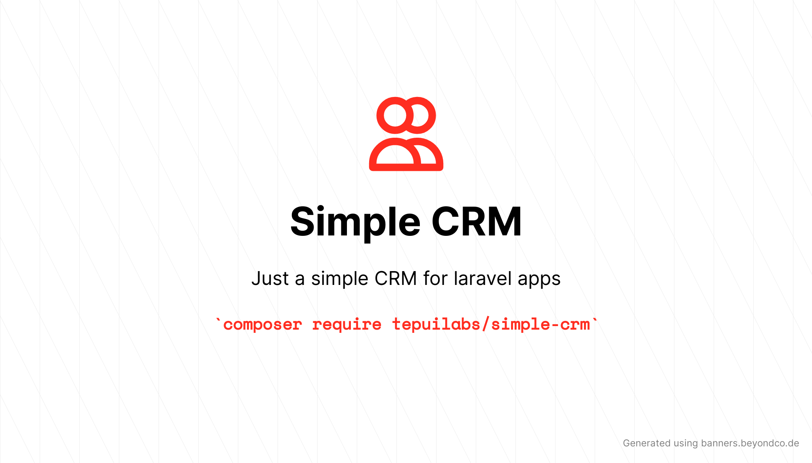

<p align="center">
	
</p>

# simple-crm

[](https://packagist.org/packages/tepuilabs/simple-crm)

[](https://packagist.org/packages/tepuilabs/simple-crm)


## Installation

You can install the package via composer:

```bash
composer require tepuilabs/simple-crm
```

You can publish the modesl with:

```bash
php artisan vendor:publish --provider="Tepuilabs\SimpleCrm\SimpleCrmServiceProvider" --tag="simple-crm-models"
```

You can publish and run the migrations with:

```bash
php artisan vendor:publish --provider="Tepuilabs\SimpleCrm\SimpleCrmServiceProvider" --tag="simple-crm-migrations"
php artisan migrate
```

## Usage

This package uses a polymorphic relationship to associate the Items model with the model of your choice, the only thing you have to do is add this to the model you want to use:

```php
public function notes(): MorphMany
{
    return $this->morphMany(\App\Models\Tepuilabs\SimpleCrm\Note::class, 'author');
}
```

## Testing

```bash
composer test
```

## Changelog

Please see [CHANGELOG](CHANGELOG.md) for more information on what has changed recently.

## Contributing

Please see [CONTRIBUTING](.github/CONTRIBUTING.md) for details.

## Security Vulnerabilities

Please review [our security policy](../../security/policy) on how to report security vulnerabilities.

## Credits

- [angel cruz](https://github.com/abr4xas)
- [All Contributors](../../contributors)

This project is based on <a href="https://www.nick-basile.com/blog/post/improving-our-laravel-nova-crm/" target="_blank">Improving Our Laravel Nova CRM</a>.

## License

The MIT License (MIT). Please see [License File](LICENSE.md) for more information.
